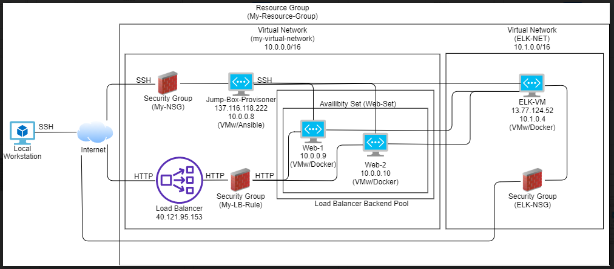
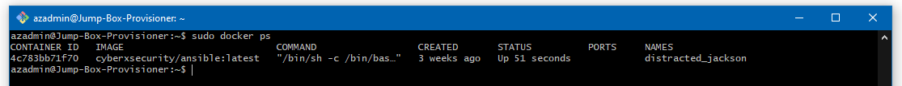

## Automated ELK Stack Deployment

The files in this repository were used to configure the network depicted below.



These files have been tested and used to generate a live ELK deployment on Azure. They can be used to either recreate the entire deployment pictured above. Alternatively, select portions of the YAML file may be used to install only certain pieces of it, such as Filebeat.

[install-elk](./Playbooks/install-elk.yml)
```
- name: Configure Elk VM with Docker
  hosts: elk
  remote_user: azadmin
  become: true
  tasks:

  - name: Install docker.io
    apt:
      update_cache: yes
      force_apt_get: yes
      name: docker.io
      state: present

  - name: Install python3-pip
    apt:
      force_apt_get: yes
      name: python3-pip
      state: present

  - name: Install Docker module
    pip:
      name: docker
      state: present

  - name: Increase virtual memory
    command: sysctl -w vm.max_map_count=262144

  - name: Use more memmory
    sysctl:
      name: vm.max_map_count
      value: "262144"
      state: present
      reload: yes

  - name: download and launch a docker elk container
    docker_container:
      name: elk
      image: sebp/elk:761
      state: started
      restart_policy: always
        - 5601:5601
        - 9200:9200
        - 5044:5044

  - name: Enable service docker on boot
    systemd:
      name: docker
      enabled: yes
```

This document contains the following details:
- Description of the Topology
- Access Policies
- ELK Configuration
  - Beats in Use
  - Machines Being Monitored
- How to Use the Ansible Build

---  
### Description of the Topology

The main purpose of this network is to expose a load-balanced and monitored instance of DVWA, the D*mn Vulnerable Web Application.

Load balancing ensures that the application will be highly available, in addition to restricting traffic to the network.

What aspect of security do load balancers protect?
- A load balancer distributes traffic evenly across servers and mitigfates DoS attacks. Load balancers offer a health probe function to regularly check all the machines behind the load balancer. Machines with issues are reported, and the load balancers stop sending traffic to those machines. 

What is the advantage of a jump box?
- A jump box is virtually identical to a single node gateway router and sits in front of other machines that are not exposed to the public internet. It controls access to the other machines by allowing connections from specific IP addresses and forwarding to those machines.

Integrating an ELK server allows users to easily monitor the vulnerable VMs for changes to the logs and system traffic.

What does Filebeat watch for?
- Filebeat monitors the log files or locations that you specify, collects log events, and forwards them either to Elasticsearch or Logstash for indexing.

What does Metricbeat record?
- Metricbeat helps you monitor your servers by collecting metrics from the system and services running on the server, and forwards them to Elasticsearch or Logstash.

The configuration details of each machine may be found below.

| Name                 | Function  | IP Address | Operating System |
|----------------------|-----------|------------|------------------|
| Jump-Box-Provisioner | Gateway   | 10.0.0.8   | Linux            |
| Web-1                | Webserver | 10.0.0.9   | Linux            |
| Web-2                | Webserver | 10.0.0.10  | Linux            |

### Access Policies

The machines on the internal network are not exposed to the public Internet. 

Only the Jump-Box-Provisioner machine can accept connections from the Internet. Access to this machine is only allowed from the following IP addresses:
- 137.116.118.222

Machines within the network can only be accessed by Jump-Box-Provisioner.
Which machine did you allow to access your ELK VM?
- My Personal Machine (only) via port 5601

What was its IP address?
- 49.XX.XX.150 (My Personal Machine Public IP)

A summary of the access policies in place can be found in the table below.

| Name                 | Publicly Accessible | Allowed IP Address       |
|----------------------|---------------------|--------------------------|
| Jump-Box-Provisioner | Yes                 | 10.0.0.8 137.116.118.222 |
| Web-1                | No                  | 10.0.0.9                 |
| Web-2                | No                  | 10.0.0.10                |
| ELK-VM               | Yes                 | 10.1.0.4 13.77.124.52    |

### Elk Configuration

Ansible was used to automate configuration of the ELK machine. No configuration was performed manually, which is advantageous because...
What is the main advantage of automating configuration with Ansible?
- It allows IT administrators to automate away the drudgery from their daily tasks. It automates and deploys to multiple machines, as opposed to laboriously configurating each machine, one by one. The larger the network, the more potential time saved.

The playbook implements the following tasks:
In 3-5 bullets, explain the steps of the ELK installation play. E.g., install Docker; download image; etc._
- Install Docker.io
- Install Python3-pip
- Install Docker Python Module
- Increase Virtual Memory
- Download and launch docker container

The following screenshot displays the result of running `docker ps` after successfully configuring the ELK instance.

**Note**: The following image link needs to be updated. Replace `docker_ps_output.png` with the name of your screenshot image file.  



### Target Machines & Beats
This ELK server is configured to monitor the following machines:
- 10.0.0.9 (Web-1)
- 10.0.0.10 (Web-2)

We have installed the following Beats on these machines:
- Filebeat
- Metricbeat

These Beats allow us to collect the following information from each machine:
In 1-2 sentences, explain what kind of data each beat collects, and provide 1 example of what you expect to see. E.g., `Winlogbeat` collects Windows logs, which we use to track user logon events, etc.
- Filebeat: monitors the log files or locations that you specify, collects log events, and forwards them either to Elasticsearch or Logstash for indexing, such as the input change of a web file.
- MetricBeat: monitors your servers by collecting metrics from the system and services running on the server, such as Apache, etc.

### Using the Playbook
In order to use the playbook, you will need to have an Ansible control node already configured. Assuming you have such a control node provisioned: 

SSH into the control node and follow the steps below:
- Copy the install-elk.yml file to filebeat-playbook.yml to /etc/ansible
- Update the install-elk.yml file to include “<IP_Address> ansible_python_interpreter=/usr/bin/python3”
- Run the playbook, and navigate to http://13.77.124.52:5601/app/kibana to check that the installation worked as expected.

Which file is the playbook? Where do you copy it?
- The playbook is filebeat-playbook.yml, and it is copied to /etc/ansible/roles/filebeat-playbook.yml

Which file do you update to make Ansible run the playbook on a specific machine? How do I specify which machine to install the ELK server on versus which to install Filebeat on?
- Update /etc/ansible/hosts to make ansible run a playbook(s) on specific host(s) and add them under their <IP_Address> to install Filebeat or other services.
```
[webservers]
10.0.0.9 ansible_python_interpreter=/usr/bin/python3
10.0.0.10 ansible_python_interpreter=/usr/bin/python3

[elk]
10.1.0.4 ansible_python_interpreter=/usr/bin/python3
```

Which URL do you navigate to in order to check that the ELK server is running?
- http://13.77.124.52:5601/app/kibana
